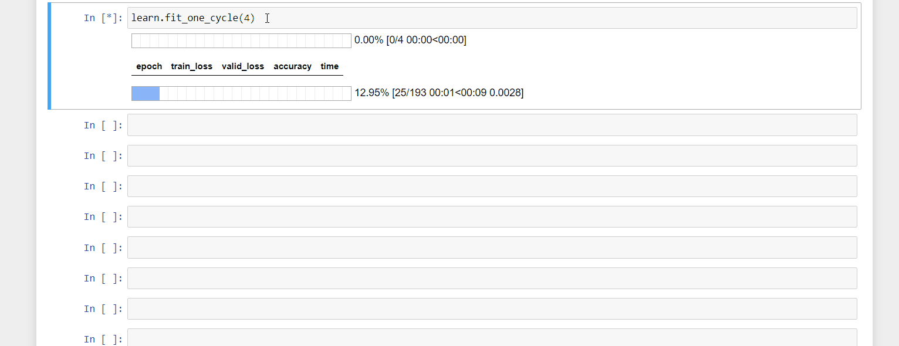

# GPUUtilizationCallback
A fastai callback to plot GPU usage during training. It's based on the data taken from the `nvidia-smi stats` command.

### Installation
None for now, copy the callback class into your code.

### Usage
Pass the `GPUUtilizationCallback` into the `cbs` argument of the `Learner`. See the notebook for examples

